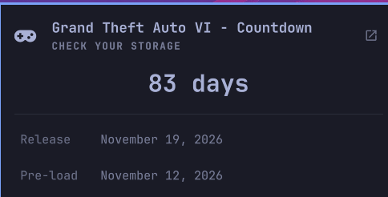

# GTA VI Countdown for Omarchy

[](https://github.com/xgborgeso/omarchy-gta6-countdown/actions/workflows/check.yml)

A minimalist Grand Theft Auto VI countdown for the Omarchy bar: one icon, a
panel with the time remaining and both dates that matter, a link to the official
page, and one reminder a day. It is pure date arithmetic — no daemon, no helper,
no network, and nothing to read from the system.

<p align="center">
  
</p>

## Features

- One icon on the bar, the same width as every other chip. The reading lives in
  the tooltip and the panel rather than a string that grows and shrinks and
  shoves its neighbours sideways once a minute
- Two readings side by side: how many sleeps away it is, and the exact time
  remaining. Above a day apart the two differ by one, and showing both makes
  that obvious instead of looking like a bug
- Pre-load as well as release, since pre-load opens a week ahead and is the date
  you actually have to act on
- One reminder a day, at an hour you choose, with a milestone line at 100 days,
  50, a month, two weeks, pre-load day, and the last three days
- A subtitle that escalates as launch approaches, from `Sit tight` at six months
  out to `This is not a drill` in the final days
- Counts to **local midnight**, because that is how Rockstar gates pre-orders,
  pre-load and launch
- Packs up after release: a farewell line, the removal command with a copy
  button, and a widget that takes itself off the bar a month later

## Install

```bash
omarchy plugin add https://github.com/xgborgeso/omarchy-gta6-countdown.git --enable
```

`--enable` puts the icon on the right of the bar.

## The dates

| | |
| --- | --- |
| Release | **November 19, 2026**, local midnight, on PS5 and Xbox Series X\|S |
| Pre-load | **November 12, 2026**, local midnight |

Rockstar confirmed November 19 in a Newswire post on November 6, 2025, and
Take-Two has reaffirmed it since. It has moved twice before, which is why
`releaseDate` is a setting rather than something baked into the code — if it
moves again you retarget it yourself instead of waiting for a release here.

## Settings

| Key | Default | What it does |
| --- | --- | --- |
| `releaseDate` | `2026-11-19` | Target date, `YYYY-MM-DD`, counted to local midnight. An unparseable value falls back to the shipped date and says so in the panel. |
| `barFormat` | `icon` | `icon` shows the glyph alone. `days` shows the sleeps count. `dhm` shows exact time remaining, and ticks every minute. |
| `panelFormat` | `both` | `both` prints the sleeps count large with the exact figure beneath it. `days` keeps only the large count. `exact` shows only the ticking figure. |
| `notifyMode` | `daily` | `daily`, `milestones` only, or `off`. |
| `notifyHour` | `9` | Earliest hour for the daily reminder, `0`–`23`. |
| `hideAfterDays` | `30` | Retire the widget this many days after release. `0` keeps it forever. |

```bash
omarchy bar set io.github.xgborgeso.gta6-countdown barFormat dhm --json
omarchy bar set io.github.xgborgeso.gta6-countdown notifyMode milestones --json
omarchy bar move io.github.xgborgeso.gta6-countdown --section right
```

### Reminders

One notification per local day, on the first tick at or after `notifyHour`.
Booting at 14:00 fires immediately; a machine left running overnight fires at
`notifyHour` rather than at midnight. The last day spoken on is written to
`$XDG_STATE_HOME/omarchy-gta6-countdown/last-notified`, so restarting the shell
five times before lunch does not produce five identical toasts.

Milestone days carry their own headline instead of the plain one:

| Sleeps left | Headline |
| --- | --- |
| 365 · 300 · 200 · 100 · 50 | `One year to go` … `50 days to go` |
| 30 | `One month to go` |
| 14 | `Two weeks to go` |
| 7 | `Pre-load is open` |
| 3 · 2 · 1 | `Three days to go` · `Two days to go` · `Tomorrow` |
| 0 | `Grand Theft Auto VI is out` |

Release day is announced, and then the countdown has nothing left to say and
stops speaking.

## After release

A countdown that outlives its date is clutter, so this one packs up on its own.

On release day the panel says `Go and play. You can remove this whenever.`
Afterwards it counts the days until it retires — `Nothing left to count.
Retiring in 12 days.` — and shows the removal command with a button that copies
it to the clipboard, so you do not have to go looking for it. On day
`hideAfterDays` the widget takes itself off the bar. Set `hideAfterDays` to `0`
if you would rather it stayed.

```bash
omarchy plugin remove io.github.xgborgeso.gta6-countdown
```

## Controls

Left click opens the panel, middle click opens the official page.

| Key | Action |
| --- | --- |
| `o` | Open [rockstargames.com/VI](https://www.rockstargames.com/VI) |
| `r` | Refresh |
| `Tab` | Next stock panel |
| `Esc` | Close |

The panel is also scriptable:

```bash
omarchy-shell io.github.xgborgeso.gta6-countdown status   # 82d 10h 24m
omarchy-shell io.github.xgborgeso.gta6-countdown days     # 83
omarchy-shell io.github.xgborgeso.gta6-countdown toggle
omarchy-shell io.github.xgborgeso.gta6-countdown link
```

## Two numbers, on purpose

The panel shows `83 days` above `82d 10h 24m remaining`, and both are correct.

`83` is how many sleeps away it is, which is what a person means by "days left".
`82d 10h` is exact time on the clock. They differ by one for most of the day and
agree at local midnight. Every bare number — the tooltip's neighbour, the `days`
bar format, every notification — uses the sleeps count; only the ticking figure
is exact.

The gap can also be more than you expect. Between August and November the clocks
go back, so there is one more real hour of waiting than the calendar suggests,
and the exact figure counts it. That is a fact about November, not a rounding
error.

## Tests

Everything testable is a pure function in `Model.js`, so the suite needs no
compositor, no shell and no display:

```bash
node tests/model.test.js
python3 tests/qml.test.py
omarchy plugin validate .
```

`tests/model.test.js` re-runs itself once per timezone — a southern-hemisphere
zone, where the clocks go the other way before launch, and a half-hour offset
among them. Half of what it checks is local-midnight behaviour, which a runner in
UTC alone would happily agree with a bug about. It also walks every day between
now and release to prove the reminder fires once a day and each milestone exactly
once.

`tests/qml.test.py` reads the QML rather than running it, and checks the things
that load fine in an editor and fail silently in the bar: a text sink left on
`Text.AutoText`, a property name starting uppercase, a manifest default nothing
reads, or a nerd-font glyph pasted in as an invisible private-use character
instead of written as an escape.

## Remove

```bash
omarchy plugin remove io.github.xgborgeso.gta6-countdown
```

## License

MIT. This is an unofficial fan project. Not affiliated with, endorsed by, or
associated with Rockstar Games or Take-Two Interactive. *Grand Theft Auto* is a
trademark of Take-Two Interactive Software, Inc., referred to here only to
identify the game being counted down to.
